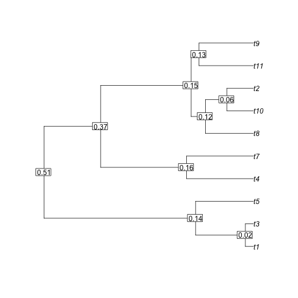
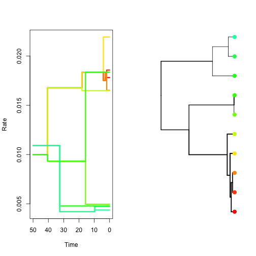
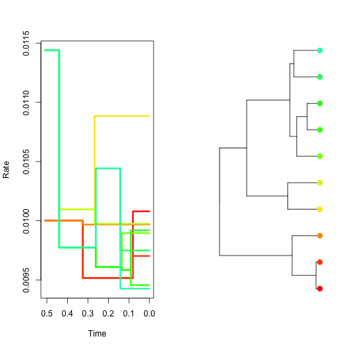
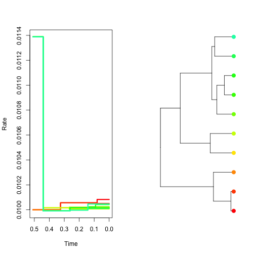
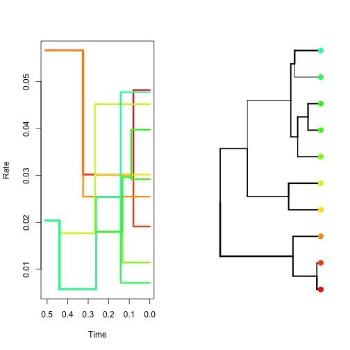

NELSI: Nucleotide EvoLutionary Simulator
=========================================


David Duchene, and Sebastian Duchene

david.duchene[at]anu.edu.au

sebastian.duchene[at]sydney.edu.au

X April 2014


Introduction
------------

Models for molecular rate variation play a key role in molecular phylogenetics. Due to their importance in evolutionary biology, there is a wide variety of models, which can be classified into five broad categories: 

- Strict clock, where a single rate is assumed for all the branches of a phylogeny, as described by [Zuckerkandl, E. and Pauling, L. (1962)](#references). 

- Local clock, in which there is a fixed number of strict clocks in a phylogenetic tree, so that the rate is constant for some lineages ([Hasegawa *et al*. 1989](#references), [Yoder and Yang. 2000](#references)).

- Autocorrelated models, where rates along a lineage evolve gradually, and therefore display a degree of correlation, such as that described by [Thorne *et al*. (1998)](#references). 

- Uncorrelated models, where the rates for each of the branches are independently and identically distributed variables, drawn from a specified probability function, sucha as the uncorrelated lognormal clock ([Drummond *et al*. 2006](#references)).

- Unconstrained models, where the rates for all branches are independent and drawn from different distributions ([Lepage *et al* 2007](#references)). 

With the increasing development of clock models, it is necessary to assess their performance with simulations and analyses of empirical data. We present NELSI, an R package to simulate rates of evolution along phylogenetic trees. The principle is similar to the program RateEvolver ([Ho *et al*. 2005](#references)), but it allows more flexibility and it can be easily combined with popular programs to simulate phylogenetic trees. In the current version we have implemented some of the most popular methods, but the pacakage is under constant development and we will include more models, as they become available. For requests and reporting bugs please contact sebastian.duchene[at]sydney.edu.au.


Description
-----------

NELSI is implemented in the R programming language, and it is available as a package in [github](https://github.com/sebastianduchene/NELSI/). It is compatible with some popular phylogenetic packages in R, such as ape ([Paradis *et al*. 2004](#references)) and phangorn ([Schliep 2011](#references)) making it accessible to users familiar with phylogenetic data in R. The main functions use phylogenetic trees of class phylo, with branch lengths representing units of time. Trees estimated in other programs can be imported with ape in NEWICK or NEXUS format. Some R packages that simulate phylogenetic trees, such as geiger and TreeSim, also produce trees of class phylo, which can be used directly with NELSI. An important requirement of simulating rates of evolution along phylogenetic trees is that the trees should correspond to chronograms, with branch lengths in units of time. 

Tutorial
========

1. Installation and setup
-------------------------

NELSI requires a recent version of R (>=2.5). If R is not installed in your machine, download and install the appropriate version [here](www.r-project.org). 

R packages can be downloaded and installed directly from [github](github.com/sebastianduchene/nelsi) with the package [devtools](https://github.com/hadley/devtools). This is the easiest way to install NELSI (and many other packages). 

We will begin by installing devtools from the Comprehensive R Archive Network (CRAN). Please follow the instructions bellow:

 - Open the R console by clicking on the R icon in your desktop or in Applications (depending on the operating system)

 - Make sure that you have an internet connection and type in the code bellow:

```
install.packages("devtools")
```

Follow the instructions in the prompt. 

 - Load devtools with the following code:


```
library(devtools)
```


 - The devtools package has a function to download packages from github repositories. To download and install NELSI type the following at the prompt:

```
install_github(rep = "NELSI", username = "sebastianduchene")
```
 - NELSI is now installed. To make all the functions available, load the package by typing:


```
library(NELSI)
```


This is all for the installation of NELSI. Please contact the authors to report any bugs. 

In the next sections of this tutorial we show an overview of some of the functions available. For a more comprehensive list, please see the manual by typing the following code in the R console:

```
help(package = NELSI)
```

2. Loading phylogenetic trees
-----------------------------

To simulate rates of evolution we need a phylogenetic tree in which the branch lengths repesetn units of time, known as a chronogram. We can simulate this kind of tree in R, but for this tutorial we will load the tree in the example_data folder in [github](github.com/sebastianduchene/nelsi). 

 - Set the R [working directory](http://www.statmethods.net/interface/workspace.html) to the example_data folder. Load the example tree with the following code:


```
myTree <- read.tree("tr_example.tree")
```


 - To get more insight into the chronogram that we have loaded, we can plot it and annotate each node with its age.


```
plot(myTree)
node.ages <- round(branching.times(myTree), 2)
nodelabels(node.ages, bg = "white")
```

 


3. Simulate constant rates through time (strict clock)
------------------------------------------------------

The simplest rate simulation model in NELSI is a strict clock, where every branch is given the same rate, with a user-specified noise level. To simulate rates under this model for our chronogram we use the function simulate.cock, which receives as arguments the chronogram, and two parameters: the mean rate and the amount of noise. 

 - As an example, we will simulate a high rate of substitutions with no noise.


```
clock.sim <- simulate.clock(myTree, params = list(rate = 0.03, noise = 0))

```

The variable clock.sim is an object of class ratesim, which is the output of all the rate simulation functions in NELSI. ratesim objects have two elements. The first is a phylogram (our input topology but with branch lengths in terms of substitutions). The second element in an object of class ratesim is a tree.data.matrix, which is a matrix with all the data about a phylogeny, includng the simulated data. The columns of a tree.data.matrix are the following: (1) is the index of each branch; (2) and (3) are the edge attribute of the class phylo, showing the parent and daughter nodes for each branchrespectively; (4) is the mid age of each branch; (5) is the simulated molecular rate for every branch; (6) is the branch lengths in substitutions per site; and (7) is branch lengths in time units.

- Inspect the tree data matrix as shown bellow:

```
clock.sim$tree.data.matrix

#      branch.index parent.node daughter.node branch.midage branch.rate
# [1,]            1          11            12   0.325090501        0.03
# [2,]            2          12            13   0.080306199        0.03
# [3,]            3          13             1   0.009929729        0.03
# [4,]            4          13             2   0.009929729        0.03
# [5,]            5          12             3   0.070376470        0.03
# [6,]            6          11            14   0.440591467        0.03
```

 - To observe how the rate changes through time in each lineage, you can plot the output of your simulation function directly using the ratesim object. The fist plot will show the rate through time for each lineage, while the second shows the chronogram with the tips coloured proportional to the rate. Therefore, colours of lines in the first plot correspond to the colours of tips in the second plot. The width of the branches is proportional to the rate. With the strict clock there is no rate variation among lineages.


```
plot(clock.sim, col.lineages = rainbow(20), type = "s")
```

 


4. Simulate autocorrelated rates
--------------------------------

One way to relax the assumption of having a single rate throughout is to propose small changes in rate from one branch to the next. The functions simulate.autocor.kishino and simulate.autocor.thorne use the method described in [Kishino *et al*.(2001)](#references) and [Thorne *et al.*(1998)](#references) methods to simulate this kind of rate pattern. In both functions the user only needs to provide the rate at the root of the phylogeny and the amount of autocorrelation, given by the parameter v. 

 - Using the following code simulate and plot autocorrelated rates using simulate.autocor.kishino; first with low autocorrelation, and then with high autocorrelation.


```
sim.low.autocor <- simulate.autocor.kishino(myTree, params = list(initial.rate = 0.01, 
    v = 0.1))
sim.high.autocor <- simulate.autocor.kishino(myTree, params = list(initial.rate = 0.01, 
    v = 0.006))
plot(sim.low.autocor, col.lineages = rainbow(20), type = "s")
```

 


```
plot(sim.high.autocor, col.lineages = rainbow(20), type = "s")
```

 


5. Simulate uncorrelated lognormal rates
----------------------------------------

To simulate rates that are uncorrelated among branches, but are independently and identically drawn from a parent distribution, we have implemented three different models for rate simulation. Each function requires different input parameters, as described in [Drummond *et al.* (2006)](#references).

 - Using the following you can simulate rates under an uncorrelated lognormal rates model, which requires the log mean and the standard deviation of the parent distribution. Note that the width of the branches varies, representing rate variation among the branches.
 

```
sim.uncor <- simulate.uncor.lnorm(myTree, params = list(mean.log = -3.9, sd.log = 0.7))
plot(sim.uncor, col.lineages = rainbow(20), type = "s")
```

 


There are other methods for rate simulation in NELSI, but this tutorial covers the most well-known models. Please refer to the package doccumentation and help files for a full list of functions.


6. Simulate nucleotide sequences using phangorn and exporting the data
----------------------------------------------------------------------

We can use the package phangorn to simulate evolvution of nucleotide or amino-acid sequence alignments along a phylogram (the first element of the ratesim object), and save it in an external file in a any format, such as FASTA, for future use.

 - Simulate a DNA alignment 2000 base-pairs long, and save it in a file.
 

```
sim.dna.data <- simSeq(sim.uncor[[1]], l = 2000, type = "DNA")
write.phyDat(sim.dna.data, file = "nelsi_tutorial_dna.fasta", format = "fasta")
```
Note that the function simSeq can simulate under different models of nucleotide substitution. Use ?simSeq to see details.

- Now save the phylogram in newick format for future reference or comparison, using the ape package.


```
write.tree(sim.uncor[[1]], file = "nelsi_tutorial_pylogram.tree")
```


7. Loading a virus data set estimated in BEAST 
-----------------------------------------------

Phylogenetic trees in NEXUS format can have a large number of annotations, with information about rates, times, or other traits for every branch in the tree. These annotations can be read in R with the function read.annotated.nexus, from pacakge [epibase](http://www.inside-r.org/packages/cran/epibase). Then the annotations cat be imported into a tree data matrix to be used with NELSI. Note that epibase is no longer supported, but we have made this function available here.

The examples_data folder contains a tree from *ENV* sequences from HIV-1 sub-type A collected between 1991 and 2008. 

 - Type the following code to read the tree (remember to set the working directory to the example_data folder):


```
hivTree <- read.annotated.nexus("hiv_A_env.tree")
```


 - Plot the tree with the function plot:


```
plot(hivTree)
axisPhylo()
```

 


The tree is a chronogram, so that the branch lengths represent units of time. The ages of the nodes can be obtained with the function branching.times, but this only works for ultrametric trees, which is not the case for these data because the samples were obtained at different points in time (heterochronous). The function allnode.times in NELSI can obtain the ages of the nodes and tips for heterochronous trees. The first items of the function are the ages of the tips, and the remaining are the ages of internal nodes.

 - Type the following code to plot the tree with out taxon names. Instead add the ages of the tips and internal nodes with the tiplabel and nodelabel functions. 


```
plot(hivTree, show.tip.label = F)
tip.ages <- round(allnode.times(hivTree), 2)  # Round to two decimal places for a clearer plot
# See the tip ages. The first 19 elements are the ages of the tips (the tree
# has 19 tips), while the remaining are the ages of internal nodes
tiplabels(tip.ages[1:19])
nodelabels(tip.ages[20:37])
axisPhylo()
```

 


The age of the youngest tip is always assigned an age of 0. The age of the root is calculated with reference to the youngest tip.


8. Obtaining the tree data matrix for a tree estimated in BEAST
---------------------------------------------------------------

We will use the tree in 7. to obtain the tree data matrix and plot the rates through time.

 - Use the function get.tree.data.matrix for the HIV tree in 7 and inspect the tree data matrix:


```
hivDataMatrix <- as.data.frame(trann2trdat(hivTree))
head(hivDataMatrix)
```

```
##   branch parent daughter midage     rate blensubs blentime
## 1      1     20       21 154.55 0.001301  0.02622   20.159
## 2      2     21       22  99.35 0.001314  0.12836   97.721
## 3      3     22        1  32.00 0.001286  0.05929   46.113
## 4      4     22       23  49.50 0.001274  0.01112    8.730
## 5      5     23        2  31.84 0.001332  0.03859   28.980
## 6      6     23       24  41.23 0.001291  0.01154    8.936
```


9. Root-to-tip regressions for trees estimated in BEAST
-------------------------------------------------------

For heterochronous data one can test the molecular clock by conducting a regression of the number of substitutions from the root to the tips vs. the time from the root to the tip, like in the program [Path-o-Gen](http://tree.bio.ed.ac.uk/software/pathogen/) (Rambaut *et al.* 2009). With the help of a few functions from NELSI, we can conduct these analyses in R.

 - Obtain the ages of the tips with the function allnode.times with the HIV chronogram. Specify the argument tipsonly = T, which will return the ages of the tips, and not those of internal nodes.


```
tipsTimes <- allnode.times(hivTree, tipsonly = T)
```


 - We can use the tree data matrix from 8. to obtan the HIV phylogram (with branch lengths in substitutions). To do this, create a copy of the chronogram in variable hivPhylogram and set the branch lengths to the number of substitutions from the tree data matrix:


```
hivPhylogram <- hivTree
hivPhylogram$edge.length <- hivDataMatrix$blensubs
```


 - The root-to-tip distances in the phylogram are the number of substutions from the root to the tips. Save this in an other variable:


```
tipsSubstitutions <- allnode.times(hivPhylogram, tipsonly = T)
```


 - The variables tipsTimes and tipsSubstitutions can be used to plot the data and test the linear regression with basic linear models:


```
plot(tipsTimes, tipsSubstitutions, pch = 20, ylab = "Substitutions from the root to tips (substitutions)", 
    xlab = "Time from the root to the tip (years)")
hivRegression <- lm(tipsSubstitutions ~ tipsTimes)
abline(hivRegression)
```

 


```
summary(hivRegression)
```

```
## 
## Call:
## lm(formula = tipsSubstitutions ~ tipsTimes)
## 
## Residuals:
##       Min        1Q    Median        3Q       Max 
## -0.007700 -0.000927  0.000179  0.002335  0.006609 
## 
## Coefficients:
##             Estimate Std. Error t value Pr(>|t|)    
## (Intercept) 0.000912   0.002026    0.45     0.66    
## tipsTimes   0.001233   0.000189    6.52  5.3e-06 ***
## ---
## Signif. codes:  0 '***' 0.001 '**' 0.01 '*' 0.05 '.' 0.1 ' ' 1
## 
## Residual standard error: 0.00386 on 17 degrees of freedom
## Multiple R-squared:  0.714,	Adjusted R-squared:  0.697 
## F-statistic: 42.5 on 1 and 17 DF,  p-value: 5.25e-06
```


In this case it the data appear to have clock-like behaviour.


References
----------

Drummond, A. J., Ho, S. Y., Phillips, M. J., & Rambaut, A. (2006). Relaxed phylogenetics and dating with confidence. *PLOS Biology*, 4(5), e88.

Kishino, H., Thorne, J. L., & Bruno, W. J. (2001). Performance of a divergence time estimation method under a probabilistic model of rate evolution. *Molecular Biology and Evolution*, 18(3), 352-361.

Hasegawa, M., Kishino, H., & Yano, T. A. (1989). Estimation of branching dates among primates by molecular clocks of nuclear DNA which slowed down in Hominoidea. *Journal of Human Evolution*, 18(5), 461-476.

Ho, S. Y., Phillips, M. J., Drummond, A. J., & Cooper, A. (2005). Accuracy of rate estimation using relaxed-clock models with a critical focus on the early metazoan radiation. Molecular Biology and Evolution, 22(5), 1355-1363.

Lepage, T., Bryant, D., Philippe, H., & Lartillot, N. (2007). A general comparison of relaxed molecular clock models. *Molecular Biology and Evolution*, 24(12), 2669-2680.

Paradis, E., Claude, J., & Strimmer, K. (2004). APE: analyses of phylogenetics and evolution in R language. *Bioinformatics*, 20(2), 289-290.

Rambaut, A. (2009). Path-O-Gen: temporal signal investigation tool.

Schliep, K. P. (2011). phangorn: Phylogenetic analysis in R. *Bioinformatics*, 27(4), 592-593.

Thorne, J.L., Kishino, H., and Painter, I.S., Estimating the rate of evolution of the rate of molecular evolution. *Molecular Biology and Evolution* 15.12 (1998): 1647-1657.

Yoder, A. D., & Yang, Z. (2000). Estimation of primate speciation dates using local molecular clocks. *Molecular Biology and Evolution*, 17(7), 1081-1090.

Zuckerkandl,E. and Pauling,L. (1962) Molecular disease, evolution, and genetic heterogeneity. In: Kasha,M. and Pullman,B. (eds) Horizons in Biochemistry. Academic Press, New York, pp. 189–225.

