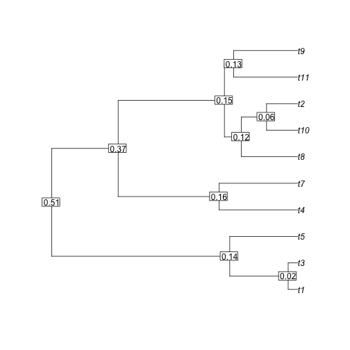
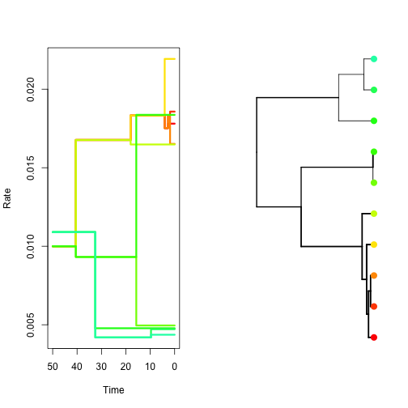
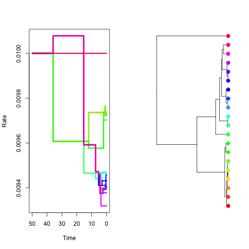
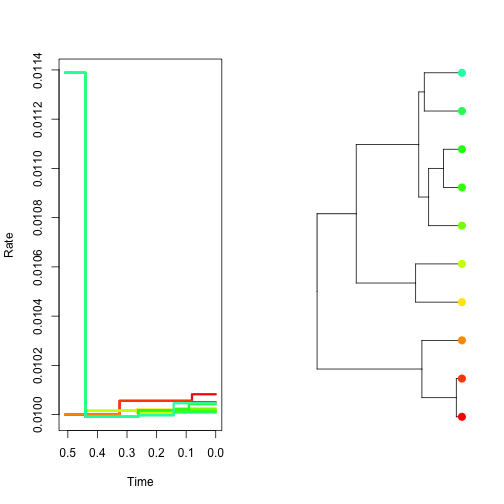
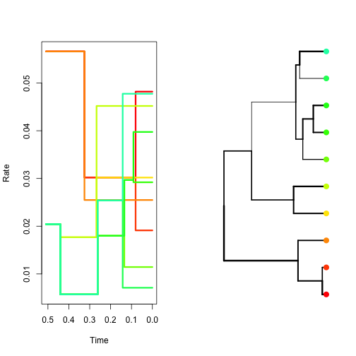
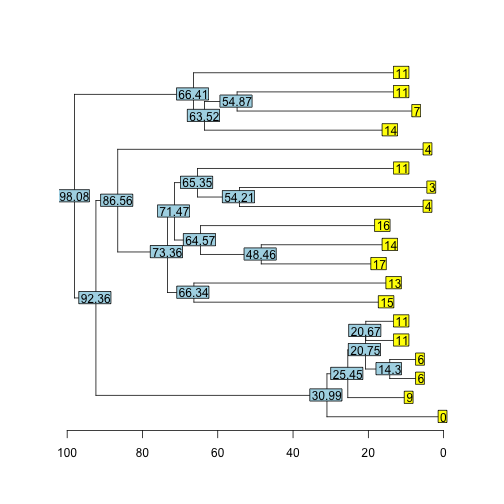

NELSI: Nucleotide EvoLutionary Simulator
=========================================

Contributors:

- David Duchene david.duchene[at]sund.ku.dk

- Sebastian Duchene sduchene[at]pasteur.fr

- Luiz Carvalho


**If you use this package for your research, please cite:**

   Ho, S. Y. W., Duchêne, S., Duchêne, D. (2015) Simulating and detecting autocorrelation of molecular evolutionary rates among lineages. 15(4) 689-696.


Introduction
------------

Models for molecular rate variation play a key role in molecular phylogenetics. Due to their importance in evolutionary biology, there is a wide variety of models, which can be classified into five broad categories: 

- Strict clock, where a single rate is assumed for all the branches of a phylogeny, as described by [Zuckerkandl, E. and Pauling, L. (1962)](#references). 

- Local clock, in which there is a fixed number of strict clocks in a phylogenetic tree, so that the rate is constant for some lineages ([Hasegawa *et al*. 1989](#references), [Yoder and Yang. 2000](#references)).

- Autocorrelated models, where rates along a lineage evolve gradually, and therefore display a degree of correlation, such as that described by [Thorne *et al*. (1998)](#references). 

- Uncorrelated models, where the rates for each of the branches are independently and identically distributed variables, drawn from a specified probability function, sucha as the uncorrelated lognormal clock ([Drummond *et al*. 2006](#references)).

- Unconstrained models, where the rates for all branches are independent and drawn from different distributions ([Lepage *et al* 2007](#references)). 

With the increasing development of clock models, it is necessary to assess their performance with simulations and analyses of empirical data. We present NELSI, an R package to simulate rates of evolution along phylogenetic trees. The principle is similar to the program RateEvolver ([Ho *et al*. 2005](#references)), but it allows more flexibility and it can be easily combined with popular programs to simulate phylogenetic trees. In the current version we have implemented some of the most popular methods, but the pacakage is under constant development and we will include more models, as they become available. For requests and reporting bugs please contact sduchene[at]pasteur.fr.


Description
-----------

NELSI is implemented in the R programming language, and it is available as a package on [GitHub](https://github.com/sebastianduchene/NELSI/). It depends on [ape](https://cran.r-project.org/package=ape) ([Popescu *et al*. 2012](#references)) for tree handling and [castor](https://cran.r-project.org/package=castor) for fast node-age calculations. The package [phangorn](https://cran.r-project.org/package=phangorn) ([Schliep 2011](#references)) is optional and can be used to simulate nucleotide sequences along the resulting phylograms (see section 6). The main functions use phylogenetic trees of class `phylo`, with branch lengths representing units of time. Trees estimated in other programs can be imported with ape in NEWICK or NEXUS format. Any R package that produces trees of class `phylo` with time-scaled branch lengths (e.g. TreeSim) can be used directly with NELSI. An important requirement is that the input trees must be chronograms, with branch lengths in units of time. 

Tutorial
========

1. Installation and setup
-------------------------

NELSI requires R (>= 3.6.0). If R is not installed in your machine, download and install the appropriate version [here](www.r-project.org). 

R packages can be downloaded and installed directly from [github](github.com/sebastianduchene/nelsi) with the package [devtools](https://github.com/hadley/devtools). This is the easiest way to install NELSI (and many other packages). 

We will begin by installing devtools from the Comprehensive R Archive Network (CRAN). Please follow the instructions bellow:

 - Open the R console by clicking on the R icon in your desktop or in Applications (depending on the operating system)

 - Make sure that you have an internet connection and type in the code bellow:

```coffee
install.packages("devtools")
```

Follow the instructions in the prompt. 

 - Load devtools with the following code:


```coffee
library(devtools)
```


 - The devtools package has a function to download packages from github repositories. To download and install NELSI type the following at the prompt:

```coffee
install_github("sebastianduchene/NELSI")
```
 - NELSI is now installed. To make all the functions available, load the package by typing:


```coffee
library(NELSI)
```


This is all for the installation of NELSI. Please contact the authors to report any bugs. 

In the next sections of this tutorial we show an overview of some of the functions available. For a more comprehensive list, please see the manual by typing the following code in the R console:

```coffee
help(package = NELSI)
```

Some examples used to generate the data for the study by  Ho. *et al* (*In Prep*) are available [here](https://github.com/sebastianduchene/NELSI/tree/master/Ho_et_al_examples).

2. Loading phylogenetic trees
-----------------------------

To simulate rates of evolution we need a phylogenetic tree in which the branch lengths represent units of time, known as a chronogram. We can simulate this kind of tree in R, but for this tutorial we will load the tree in the example_data folder in [github](github.com/sebastianduchene/nelsi). 

 - Set the R [working directory](http://www.statmethods.net/interface/workspace.html) to the example_data folder. Load the example tree with the following code:


```coffee
myTree <- read.tree("tr_example.tree")
```


 - To get more insight into the chronogram that we have loaded, we can plot it and annotate each node with its age.


```coffee
plot(myTree)
node.ages <- round(branching.times(myTree), 2)
nodelabels(node.ages, bg = "white")
```

 


3. Simulate constant rates through time (strict clock)
------------------------------------------------------

The simplest rate simulation model in NELSI is a strict clock, where every branch is given the same rate, with a user-specified noise level. To simulate rates under this model for our chronogram we use the function simulate.clock, which receives as arguments the chronogram, and two parameters: the mean rate and the amount of noise. 

 - As an example, we will simulate a high rate of substitutions with no noise.


```coffee
clock.sim <- simulate.clock(myTree, params = list(rate = 0.03, noise = 0))

```

The variable clock.sim is an object of class ratesim, which is the output of all the rate simulation functions in NELSI. ratesim objects have two elements. The first is a phylogram (our input topology but with branch lengths in terms of substitutions). The second element in an object of class ratesim is a tree.data.matrix, which is a matrix with all the data about a phylogeny, includng the simulated data. The columns of a tree.data.matrix are the following: (1) is the index of each branch; (2) and (3) are the edge attribute of the class phylo, showing the parent and daughter nodes for each branchrespectively; (4) is the mid age of each branch; (5) is the simulated molecular rate for every branch; (6) is the branch lengths in substitutions per site; and (7) is branch lengths in time units.

- Inspect the tree data matrix as shown bellow:

```coffee
clock.sim$tree.data.matrix

#      branch.index parent.node daughter.node branch.midage branch.rate
# [1,]            1          11            12   0.325090501        0.03
# [2,]            2          12            13   0.080306199        0.03
# [3,]            3          13             1   0.009929729        0.03
# [4,]            4          13             2   0.009929729        0.03
# [5,]            5          12             3   0.070376470        0.03
# [6,]            6          11            14   0.440591467        0.03
```

 - You can print a concise summary of a ratesim object or inspect its rate statistics:

```coffee
print(clock.sim)
# Rate simulation (ratesim)
#   Tips:      10
#   Branches:  18
#   Rates:    min = 3e-02 | mean = 3e-02 | max = 3e-02

summary(clock.sim)
# Rate simulation summary
#
# Tree
#   Tips:               10
#   Branches:           18
#   Total time length:  ...
#   Total subst length: ...
#
# Branch rates
#   Min. 1st Qu.  Median    Mean 3rd Qu.    Max.
#   0.03    0.03    0.03    0.03    0.03    0.03
```

 - To observe how the rate changes through time in each lineage, you can plot the output of your simulation function directly using the ratesim object. The fist plot will show the rate through time for each lineage, while the second shows the chronogram with the tips coloured proportional to the rate. Therefore, colours of lines in the first plot correspond to the colours of tips in the second plot. The width of the branches is proportional to the rate. With the strict clock there is no rate variation among lineages.


```coffee
plot(clock.sim, col.lineages = rainbow(20), type = "s")
```

 


4. Simulate autocorrelated rates
--------------------------------

One way to relax the assumption of having a single rate throughout is to propose small changes in rate from one branch to the next. The functions simulate.autocor.kishino and simulate.autocor.thorne use the method described in [Kishino *et al*.(2001)](#references) and [Thorne *et al.*(1998)](#references) methods to simulate this kind of rate pattern. In both functions the user only needs to provide the rate at the root of the phylogeny and the amount of autocorrelation, given by the parameter v. 

 - Using the following code simulate and plot autocorrelated rates using simulate.autocor.kishino; first with low autocorrelation, and then with high autocorrelation.


```coffee
sim.low.autocor <- simulate.autocor.kishino(myTree, params = list(initial.rate = 0.01, 
    v = 0.1))
sim.high.autocor <- simulate.autocor.kishino(myTree, params = list(initial.rate = 0.01, 
    v = 0.006))
plot(sim.low.autocor, col.lineages = rainbow(20), type = "s")
```

 


```coffee
plot(sim.high.autocor, col.lineages = rainbow(20), type = "s")
```

 


5. Simulate uncorrelated lognormal rates
----------------------------------------

To simulate rates that are uncorrelated among branches, but are independently and identically drawn from a parent distribution, we have implemented three different models for rate simulation. Each function requires different input parameters, as described in [Drummond *et al.* (2006)](#references).

 - Using the following you can simulate rates under an uncorrelated lognormal rates model, which requires the log mean and the standard deviation of the parent distribution. Note that the width of the branches varies, representing rate variation among the branches.
 

```coffee
sim.uncor <- simulate.uncor.lnorm(myTree, params = list(mean.log = -3.9, sd.log = 0.7))
plot(sim.uncor, col.lineages = rainbow(20), type = "s")
```

 


There are other methods for rate simulation in NELSI, but this tutorial covers the most well-known models. Please refer to the package doccumentation and help files for a full list of functions.


6. Simulate nucleotide sequences using phangorn and exporting the data
----------------------------------------------------------------------

We can use the package phangorn to simulate evolvution of nucleotide or amino-acid sequence alignments along a phylogram (the first element of the ratesim object), and save it in an external file in a any format, such as FASTA, for future use.

 - Simulate a DNA alignment 2000 base-pairs long, and save it in a file.
 

```coffee
sim.dna.data <- simSeq(sim.uncor[[1]], l = 2000, type = "DNA")
write.phyDat(sim.dna.data, file = "nelsi_tutorial_dna.fasta", format = "fasta")
```
Note that the function simSeq can simulate under different models of nucleotide substitution. Use ?simSeq to see details.

- Now save the phylogram in newick format for future reference or comparison, using the ape package.


```coffee
write.tree(sim.uncor[[1]], file = "nelsi_tutorial_pylogram.tree")
```


7. Loading a virus data set estimated in BEAST 
-----------------------------------------------

Phylogenetic trees in NEXUS format can have a large number of annotations, with information about rates, times, or other traits for every branch in the tree. These annotations can be read in R with the function read.annotated.nexus, from pacakge [epibase](http://www.inside-r.org/packages/cran/epibase). Then the annotations cat be imported into a tree data matrix to be used with NELSI. Note that epibase is no longer supported, but we have made this function available here.

The examples_data folder contains a tree from *ENV* sequences from HIV-1 sub-type A collected between 1991 and 2008. 

 - Type the following code to read the tree (remember to set the working directory to the example_data folder):


```coffee
hivTree <- read.annotated.nexus("hiv_A_env.tree")
```


 - Plot the tree with the function plot:


```coffee
plot(hivTree)
axisPhylo()
```

 


The tree is a chronogram, so that the branch lengths represent units of time. The ages of the nodes can be obtained with the function branching.times, but this only works for ultrametric trees, which is not the case for these data because the samples were obtained at different points in time (heterochronous). The function all.node.times in NELSI can obtain the ages of the nodes and tips for heterochronous trees. The first items of the function are the ages of the tips, and the remaining are the ages of internal nodes.

 - Type the following code to plot the tree with out taxon names. Instead add the ages of the tips and internal nodes with the tiplabel and nodelabel functions. 


```coffee
plot(hivTree, show.tip.label = F)
tip.ages <- round(all.node.times(hivTree), 2)  # Round to two decimal places for a clearer plot
# See the tip ages. The first 19 elements are the ages of the tips (the tree
# has 19 tips), while the remaining are the ages of internal nodes
tiplabels(tip.ages[1:19])
nodelabels(tip.ages[20:37])
axisPhylo()
```

 


The age of the youngest tip is always assigned an age of 0. The age of the root is calculated with reference to the youngest tip.


8. Obtaining the tree data matrix for a tree estimated in BEAST
---------------------------------------------------------------

We will use the tree in 7. to obtain the tree data matrix and plot the rates through time.

 - Use the function get.tree.data.matrix for the HIV tree in 7 and inspect the tree data matrix:


```coffee
hivDataMatrix <- as.data.frame(trann2trdat(hivTree))
head(hivDataMatrix)
```

```coffee
##   branch parent daughter midage     rate blensubs blentime
## 1      1     20       21 154.55 0.001301  0.02622   20.159
## 2      2     21       22  99.35 0.001314  0.12836   97.721
## 3      3     22        1  32.00 0.001286  0.05929   46.113
## 4      4     22       23  49.50 0.001274  0.01112    8.730
## 5      5     23        2  31.84 0.001332  0.03859   28.980
## 6      6     23       24  41.23 0.001291  0.01154    8.936
```


9. Root-to-tip regressions for trees estimated in BEAST
-------------------------------------------------------

For heterochronous data one can test the molecular clock by conducting a regression of the number of substitutions from the root to the tips vs. the time from the root to the tip, like in the program [TempEst](http://tree.bio.ed.ac.uk/software/tempest/) [(Rambaut *et al.* 2016)](http://dx.doi.org/10.1093/ve/vew007). With the help of a few functions from NELSI, we can conduct these analyses in R.

 - Obtain the ages of the tips with the function all.node.times with the HIV chronogram. Specify the argument tipsonly = T, which will return the ages of the tips, and not those of internal nodes.


```coffee
tipsTimes <- all.node.times(hivTree, tipsonly = T)
```


 - We can use the tree data matrix from 8. to obtan the HIV phylogram (with branch lengths in substitutions). To do this, create a copy of the chronogram in variable hivPhylogram and set the branch lengths to the number of substitutions from the tree data matrix:


```coffee
hivPhylogram <- hivTree
hivPhylogram$edge.length <- hivDataMatrix$blensubs
```


 - The root-to-tip distances in the phylogram are the number of substutions from the root to the tips. Save this in an other variable:


```coffee
tipsSubstitutions <- all.node.times(hivPhylogram, tipsonly = T)
```


 - The variables tipsTimes and tipsSubstitutions can be used to plot the data and test the linear regression with basic linear models:


```coffee
plot(tipsTimes, tipsSubstitutions, pch = 20, ylab = "Substitutions from the root to tips (substitutions)", 
    xlab = "Time from the root to the tip (years)")
hivRegression <- lm(tipsSubstitutions ~ tipsTimes)
abline(hivRegression)
```

 


```coffee
summary(hivRegression)
```

```coffee
## 
## Call:
## lm(formula = tipsSubstitutions ~ tipsTimes)
## 
## Residuals:
##       Min        1Q    Median        3Q       Max 
## -0.007700 -0.000927  0.000179  0.002335  0.006609 
## 
## Coefficients:
##             Estimate Std. Error t value Pr(>|t|)    
## (Intercept) 0.000912   0.002026    0.45     0.66    
## tipsTimes   0.001233   0.000189    6.52  5.3e-06 ***
## ---
## Signif. codes:  0 '***' 0.001 '**' 0.01 '*' 0.05 '.' 0.1 ' ' 1
## 
## Residual standard error: 0.00386 on 17 degrees of freedom
## Multiple R-squared:  0.714,	Adjusted R-squared:  0.697 
## F-statistic: 42.5 on 1 and 17 DF,  p-value: 5.25e-06
```


In this case it the data appear to have clock-like behaviour.


10. Reading BEAST 2 summary trees and their annotations
--------------------------------------------------------

The tree used in sections 7 to 9 was estimated in BEAST 1. The same function, `read.annotated.nexus`, reads the maximum clade credibility (MCC) trees written by TreeAnnotator in BEAST 2. The example_data folder contains `h1n1_beast2_mcc.tree`, an MCC tree summarised from a BEAST 2.7 analysis of 34 influenza A/H1N1 sequences collected in 2009 (TreeAnnotator was run with `-burnin 10 -height keep -topology MCC`).

 - Read the tree:

```coffee
tr <- read.annotated.nexus("h1n1_beast2_mcc.tree")
names(tr)
```

```coffee
## [1] "edge"        "Nnode"       "tip.label"   "edge.length" "root.edge"
## [6] "annotations"
```

The object is an ordinary `phylo`, so everything else in ape and NELSI works on it. The metadata that BEAST wrote between square brackets is in `tr$annotations`.

### How the annotations are indexed

`tr$annotations` is a **named** list. The names are node numbers, given in the row order of `tr$edge`:

```coffee
names(tr$annotations)[1:6]
tr$edge[1:6, 2]
```

```coffee
## [1] "36" "37" "38" "39" "40" "1"
## [1] 36 37 38 39 40  1
```

So element `i` holds the annotations of the node at the child end of edge `i`, and therefore describes both that node and the branch `tr$edge.length[i]` leading to it. Annotations can be pulled out either positionally, by edge, or by node number — they give the same thing:

```coffee
tr$annotations[[1]]$posterior       # by edge: the branch in row 1 of tr$edge
tr$annotations[["36"]]$posterior    # by node: node 36
```

```coffee
## [1] 0.5774416
## [1] 0.5774416
```

There is one element per edge plus one for the root, which is the last element and is named with the root node number, `Ntip(tr) + 1`:

```coffee
str(tr$annotations[[as.character(Ntip(tr) + 1)]])
```

```coffee
## List of 6
##  $ height        : num 0.198
##  $ height_95%_HPD: num [1:2] 0.144 0.265
##  $ height_median : num 0.192
##  $ height_range  : num [1:2] 0.122 0.515
##  $ length        : num 0
##  $ posterior     : num 1
```

Interval-valued annotations such as `height_95%_HPD` are returned as length-two vectors. Use `simplify = FALSE` for the older behaviour, in which they are lists of two length-one elements.

### Collecting annotations into a data frame

Because the names are node numbers, the annotations of any subset of nodes can be gathered directly. Here are the posterior support and node ages of the internal nodes:

```coffee
internal <- as.integer(names(tr$annotations)) > Ntip(tr)
support <- data.frame(
    node      = as.integer(names(tr$annotations))[internal],
    posterior = sapply(tr$annotations[internal], function(a) a$posterior),
    height    = sapply(tr$annotations[internal], function(a) a$height),
    hpd.low   = sapply(tr$annotations[internal], function(a) a[["height_95%_HPD"]][1]),
    hpd.high  = sapply(tr$annotations[internal], function(a) a[["height_95%_HPD"]][2]))
head(support, 5)
```

```coffee
##    node posterior    height    hpd.low  hpd.high
## 36   36 0.5774416 0.1794936 0.13083709 0.2380253
## 37   37 0.3044500 0.1794276 0.12900099 0.2397522
## 38   38 1.0000000 0.1481526 0.10958936 0.1927642
## 39   39 1.0000000 0.1320397 0.09818244 0.1719970
## 40   40 1.0000000 0.1207624 0.08765353 0.1587288
```

```coffee
sum(support$posterior > 0.95)  # well-supported clades, out of 33
```

```coffee
## [1] 28
```

Because the node numbering matches the tree, these values can be put straight onto a plot:

```coffee
plot(tr, show.tip.label = FALSE)
nodelabels(round(support$posterior, 2), node = support$node, frame = "none", cex = 0.6)
axisPhylo()
```

### Files with more than one tree

Annotations are only parsed for files that contain a single tree, which is the usual case for summary trees. A posterior sample of trees (a BEAST `.trees` file, not included here because such files are large) is returned as a `multiPhylo` object **without** annotations, with a warning:

```coffee
posterior <- read.annotated.nexus("my_beast2_run.trees")
```

```coffee
## Warning message:
## the file contains 1094 trees: returning a 'multiPhylo' object WITHOUT
## annotations. Annotations are only parsed for files with a single tree, such
## as summary trees written by TreeAnnotator.
```

Reading a posterior sample this way is fast, and the trees are the same as those returned by `ape::read.nexus`. A TREES block that was never closed, for example because a run was stopped part way through writing it, is read up to the last complete tree.

### A note on tip labels

Up to version 0.22, `read.annotated.nexus` assigned translated tip labels positionally, which assumed that the tips appeared in the Newick string in the same order as in the TRANSLATE block of the NEXUS file. BEAST writes them in topological order instead, so the function returned trees with the right topology and branch lengths but permuted, and therefore wrong, tip labels. This is fixed: the order in which the tips actually occur in the Newick string is re-derived and the labels are mapped through the TRANSLATE table. The result can be checked against ape at any time:

```coffee
all.equal(tr, read.nexus("h1n1_beast2_mcc.tree"), use.edge.length = TRUE)
```

```coffee
## [1] TRUE
```

Passing `check = TRUE` to `read.annotated.nexus` makes it run this comparison itself and warn if the two disagree.


References
----------

Drummond, A. J., Ho, S. Y., Phillips, M. J., & Rambaut, A. (2006). Relaxed phylogenetics and dating with confidence. *PLOS Biology*, 4(5), e88.

Hasegawa, M., Kishino, H., & Yano, T. A. (1989). Estimation of branching dates among primates by molecular clocks of nuclear DNA which slowed down in Hominoidea. *Journal of Human Evolution*, 18(5), 461-476.

Heath, T. A., Holder, M. T., & Huelsenbeck, J. P. (2012). A dirichlet process prior for estimating lineage-specific substitution rates. *Molecular Biology and Evolution*, 29(3), 939-955.

Ho, S. Y., Phillips, M. J., Drummond, A. J., & Cooper, A. (2005). Accuracy of rate estimation using relaxed-clock models with a critical focus on the early metazoan radiation. *Molecular Biology and Evolution*, 22(5), 1355-1363.

Ho, S. Y., Duchêne, S., Duchêne, D. (2015) Simulating and detecting autocorrelation of molecular evolutionary rates among lineages. 15(4) 689-696.

Kishino, H., Thorne, J. L., & Bruno, W. J. (2001). Performance of a divergence time estimation method under a probabilistic model of rate evolution. *Molecular Biology and Evolution*, 18(3), 352-361.

Lepage, T., Bryant, D., Philippe, H., & Lartillot, N. (2007). A general comparison of relaxed molecular clock models. *Molecular Biology and Evolution*, 24(12), 2669-2680.

Popescu, A. A., Huber, K. T., & Paradis, E. (2012). Ape 3.0: New tools for distance-based phylogenetics and evolutionary analysis in R. *Bioinformatics*, 28(11), 1536-1537.

Rambaut, A.,  Lam, T.,  Carvalho, L., Pybus, O. (2016) Exploring the temporal structure of heterochronous sequences using TempEst. *Virus Evolution* 2: vew007

Saulnier, E., Gascuel, O., Alizon, S. (2016) Assessing the accuracy of Approximate Bayesian Computation approaches to infer epidemiological parameters from phylogenies. *bioRxiv* doi: http://dx.doi.org/10.1101/050211.

Schliep, K. P. (2011). phangorn: Phylogenetic analysis in R. *Bioinformatics*, 27(4), 592-593.

Thorne, J.L., Kishino, H., and Painter, I.S., Estimating the rate of evolution of the rate of molecular evolution. *Molecular Biology and Evolution* 15.12 (1998): 1647-1657.

Yoder, A. D., & Yang, Z. (2000). Estimation of primate speciation dates using local molecular clocks. *Molecular Biology and Evolution*, 17(7), 1081-1090.

Zuckerkandl,E. and Pauling,L. (1962) Molecular disease, evolution, and genic heterogeneity. In: Kasha,M. and Pullman,B. (eds) Horizons in Biochemistry. Academic Press, New York, pp. 189–225.


Bugs and version history
------------------------

New features and bug fixes — August 2026 (v0.23)
----

**`read.annotated.nexus` rewritten** (see section 10 of the tutorial)
- Fixed wrong tip labels. Translated labels were assigned positionally (`tree$tip.label <- TRANS[, 2]`), which assumes the tips appear in the Newick string in TRANSLATE-block order. BEAST writes them in topological order, so the function returned trees with the correct topology and branch lengths but permuted tip labels. The tip order is now re-derived from the Newick string and the labels mapped through the TRANSLATE table. This affected the package's own `example_data/hiv_A_env.tree`.
- `$annotations` is now a named list, the names being node numbers in the row order of `$edge`, so annotations can be retrieved by node as well as by edge.
- Files with several trees now return a `multiPhylo` object without annotations and with a warning, instead of a mislabelled annotated object.
- A TREES block with no closing `End;`, as left by a run that was stopped part way through writing, is now read up to its last complete tree rather than failing with `Error in start:end : NA/NaN argument`.
- Tree names are no longer mangled for tab-indented NEXUS files (`"\ttree STATE_1"` instead of `"STATE_1"`).
- New arguments `simplify` (return interval annotations such as `height_95%_HPD` as length-two vectors; default `TRUE`) and `check` (compare the result with `ape::read.nexus` and warn if they differ; default `FALSE`).
- New tests in `tests/testthat/test-annotated-tree-reader.R`, and a BEAST 2.7 example tree in `example_data/h1n1_beast2_mcc.tree`.

**`read.annotated.tree` and the shared Newick parser**
- `$annotations` is now named by node, exactly as in `read.annotated.nexus`, and `read.annotated.tree` gained the same `simplify` argument.
- Fixed the mapping of annotations onto nodes in `.annotated.tree.build`. Annotations were taken in file order and handed out one per node visited, which assumes that every node is annotated. A tree in which only some nodes carry `[&...]` metadata failed with `Error in annotations[[k]] : subscript out of bounds`, or, when the counts happened to line up, silently attached annotations to the wrong nodes. Each node's annotation is now identified from the placeholder left in its own token, so trees that are fully, partly, or not at all annotated are all read correctly.

New features — April 2026 (v0.22)
----

**Performance and dependencies**
- Replaced phangorn-based node-age calculation with [castor](https://cran.r-project.org/package=castor) (`get_all_distances_to_root`), giving substantially faster performance on large trees.
- Removed geiger from dependencies entirely; phangorn moved to Suggests (only needed for `simSeq` to simulate sequences).

**Function naming — standardised to dot-separated lowercase throughout**
- `allnode.times` → `all.node.times`
- `intnode.times` → `int.node.times`
- `simulate.FLC` → `simulate.flc`
- `pathnode` → `path.node`
- `distunlab` → `dist.unlab`
- Internal helpers in `dist.unlab.R` renamed to dot-prefixed style (e.g. `.get.label.from.pairs`)

**New S3 methods**
- `print.ratesim()`: prints a one-line summary of a rate simulation (tips, branches, rate range).
- `summary.ratesim()`: prints tree dimensions, total branch length, and a five-number summary of branch rates.

**Documentation**
- All documentation regenerated with roxygen2; every exported function now has a `man/` page with a runnable example.
- README updated: corrected dependency descriptions, R version requirement (≥ 3.6.0), contact details, and version history.

**Robustness**
- Added input validation (`stop()` checks) to key user-facing functions: `all.node.times`, `simulate.rate`, `get.tree.data.matrix`, `get.lineage.time.rate`, `get.clock.data`, `get.rate.descendant.pairs`, `plot.ratesim`, `sum.descending.branches`.
- Fixed `get.ordinates()`: rewrote to use a correct post-order traversal and direct child lookup from `tr$edge`; the previous code silently produced `NA` coordinates for many tree topologies.
- Fixed `simulate.dpp()`: `rdirichlet()` was called but never declared as a dependency; now implemented inline.

**Testing and CI**
- Added GitHub Actions workflow (`.github/workflows/R-CMD-check.yml`) that runs `R CMD check` on Ubuntu, macOS, and Windows across R release and devel.
- Fixed the test suite: source files were listed but never actually loaded; corrected a path computation error that caused the sourcing mechanism to look in the wrong directory.

New features 17 May 2024
----

- New function plot.tree.lines to plot a phylogenetic tree using line segments, which gives full control over how each branch is drawn.


New Features 2 June 2022
- Functions to simulate fixed local clocks (simulate.flc).

New Features 14 April 2022
----
- Lineage functions to obtain all monophyletic groups that match a regular expression (find.monophyletic).


New features 12 April 2022
------------

- Function is.polytomy to query whether a particular node is a polytomy. This function should then be used with extensions to travere trees and find monophyletic groups and their sister taxa.

- Function find.sister to obtain the tips in the sister clade of a given node or set of tips.


New features 30 June 2020
------------

- New function get.mrca to obtain the most recent common ancestor of a set of tips.


New features June 2018
------------

Several functions to summarise the branch lengths of a tree, mostly for use as summary statistics:

- get.branches.age.sorted: branch lengths sorted by the age of their terminal node.

- get.external.branch.length and get.internal.branch.length: the external (terminal) and internal branch lengths.

- get.deepest.br.length: total length of the branches descending from the root.

- get.oldest.branch.length: length of the shortest root-descending branch.

- get.first.node.height: age of the third-oldest internal node.


New features October and November 2017
------------

- New function make.lsd.dates to write a sampling-date file for [LSD](https://github.com/tothuhien/lsd2).

- New function get.internal.branch.length for the internal branch lengths of a tree.


New features 20 December 2016
------------

- New function stemmy to calculate the stemminess of a phylogenetic tree.


New features 13 December 2016
------------

- New function get.ltt.summary.R calculates some statistics for the lineages through time plots of non-ultrametric trees. Some of these statistics were first used by [Saulnier *et al.* 2016](#references).

- New function dist.topo.normalised estimates PH85 tree topology distance divided by the maximum distance between two trees of the same size and structure. This is done by randomising the tip labels for one of the trees to generate a *null* distribution of the PH85 tree topology distance.

- New functions get.ancestor.nodes.branches and get.descending.nodes.branches to manipulate rooted phylogenetic trees. Help for these funcitons pending.

- New function to simulate rates under the dirichlet process, as described by [Heath *et al*. 2012](#references).

- New function to obtain node times for internal nodes only. Can be used for ultrametric and non-ultrametric trees.

- Experimental function to get all the tips that descend from a node. Similar to function 'tips' from GEIGER.


New features 24 November 2016
------------

- New function get.df to calculate a branch-length imbalance statistic.


6 November 2014

- 0.21 - Removed phangorn dependency in all.node.times


Functions present since the first release (March 2014) but not listed above
------------

For completeness, these exported functions have been in the package from the beginning and had never been mentioned in this history:

- get.rtt.dist and node.to.tip.dist: patristic distance from the root to each tip. The two are equivalent; node.to.tip.dist is kept as an alias.

- mid.edge.ages: midpoint ages of all branches.

- simulate.uncor.exp, simulate.uncor.gamma and simulate.white.noise: uncorrelated exponential, uncorrelated gamma and white-noise rate models, alongside the lognormal model described in section 5 of the tutorial.

- simulate.tdep.ho: time-dependent rates under the model of [Ho *et al*. (2005)](#references).


